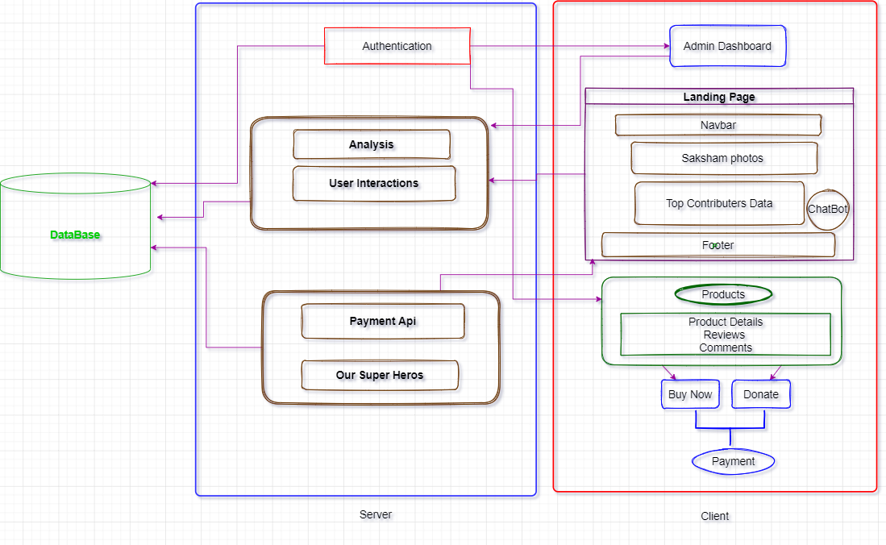
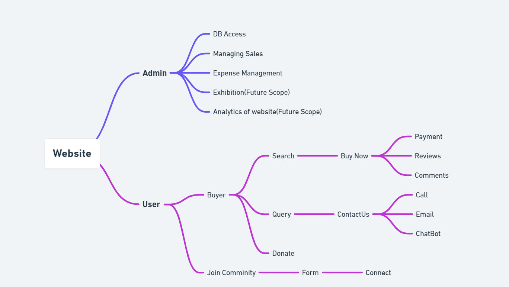

# Saksham

As they say “Out of sight, out of mind”, this is the current
situation with age-old artifacts.

These artifacts made by few families, generally living in various villages all over India, hold ethnic values but sadly somewhere among the city lights and our busy lives, these heritage beauties have become invisible to us.

This has led to loss of earning for the families who do not have the means to promote them to the wider market
and even if they are able to sell their products, but unfortunately, they are somewhere exploited by the so-called middle men who tend to keep the lion share of the profit.

  

To tackle this issue we have come forward with a web platform that gives the urban people access to
these artifacts easily and makes it easier for us to buy these products which in turn benefits the tribal and rural craftsmen as they can now sell their products world wide with our website.

## Video Link

[Video](https://drive.google.com/file/d/17QWA_zgmWfxeNUZJTXy7jckv0HpLj7k7/view?usp=sharing)

## Presentation Link

[Presentation](https://www.canva.com/design/DAE8FQVvHkI/NHEDmiY8N494DDVBTkX55A/edit?utm_content=DAE8FQVvHkI&utm_campaign=designshare&utm_medium=link2&utm_source=sharebutton)

## Tech Stacks Used

React Js

Express Js

Node Js

MongoDB

Payment Gateway- Razorpay

## Dependencies Used

Front End:-

    "bootstrap": "^5.1.3",
    "react": "^17.0.2",
    "react-bootstrap": "^2.2.2",
    "react-dom": "^17.0.2",
    "react-router-dom": "^6.2.2",
    "react-scripts": "5.0.0",
    "web-vitals": "^2.1.4"

Back End:-

    "dependencies": {
    "@hapi/joi": "^17.1.1",
    "bcrypt": "^5.0.1",
    "cors": "^2.8.5",
    "cookie-parser": "^1.4.6",
    "dotenv": "^16.0.0",
    "express": "^4.17.3",
    "http-errors": "^2.0.0",
    "jsonwebtoken": "^8.5.1",
    "mongoose": "^6.2.8",
    "morgan": "^1.10.0",
    "razorpay": "^2.8.1",
    "shortid": "^2.2.16"}

## Flow Chart

## Web Flow

## To run Project

Server:-

    run npm i
    run node server.js

Client:-

    run npm i
    run npm start
